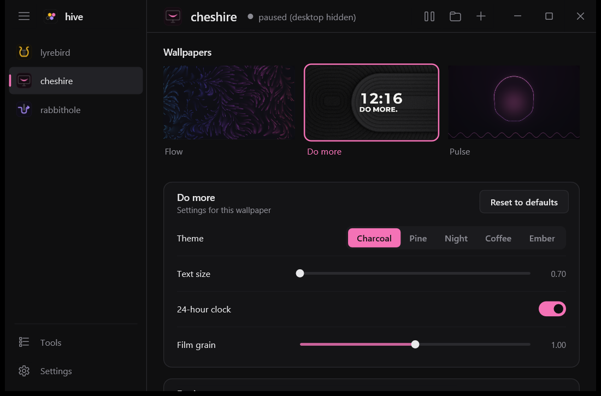

<p align="center">
  
</p>

<p align="center">
  <a href="https://github.com/matrixdurden/hive/releases/latest"></a>
  
  
  <a href="LICENSE"></a>
</p>

<p align="center"><b>English</b> · <a href="README.tr.md">Türkçe</a></p>

<br>

## Install

Paste into PowerShell:

```powershell
irm https://github.com/matrixdurden/hive/raw/main/install.ps1 | iex
```

No administrator needed. After that hive downloads new versions by itself, verifies them and installs them the next time it starts (or right away from Settings; automatic updates can be turned off).

## Tools

Every tool comes with hive: turn on the ones you want on the **Tools** page. Every tool you turn on shows up in the sidebar and in the Start menu under its own name; search for "Battery" and hive opens on it.

| | | |
|:---:|---|---|
|  | **Soundboard** | A soundboard that plays straight into your microphone. No virtual microphone: Discord, games, OBS, anything that listens to the mic hears it. Find sounds on Myinstants without leaving it (listen on your headphones, add with one click), and grab the last 10 seconds your computer played with a shortcut (`Ctrl+Alt+L`). |
|  | **Wallpaper** | Live wallpapers drawn by your GPU behind the desktop icons. Pauses on its own in fullscreen and on battery. |
|  | **Tunnel** | Tunnels your whole computer past network blocks: through your own server, or serverless in DPI mode. [Separate repository](https://github.com/matrixdurden/rabbithole). |
|  | **Battery** | Three gears for a laptop: plugged in, out for an hour or two, survival. Switches on its own when the charger comes and goes, keeps the discrete GPU asleep on battery and learns how long each gear really lasts. |
|  | **Audio devices** | Audio outputs and inputs in one list: click one to make it the default. One key switches to the next output (`Ctrl+Alt+O`), next input (`Ctrl+Alt+I`) or mutes the microphone (`Ctrl+Alt+K`). And when your headphones drop, the music pauses instead of carrying on from the laptop speakers. |
|  | **Dock** | A dock in place of the Windows taskbar, in the Windows 11 look: your pinned apps and the running ones in one floating bar, with Wi-Fi, sound, battery and the clock at its end. Icons under the cursor grow, apps bounce when they want your attention, hovering shows live previews of their windows and you rearrange them by dragging. It always stays on screen, maximized windows end above it, and it stays out of fullscreen games. Throw the cursor into the top-left corner to see all windows (Win+Tab), into the bottom-right corner for the desktop (both can be turned off). Win+1…9 opens the apps in dock order; "Pin to dock" is in the right-click menu. Remove it and the taskbar and Start come back as they were. |
|  | **Music** | What Spotify is playing, in a strip next to the dock, as tall as the dock: cover, song, artist, previous / play / next and a thin progress line you can click to seek. Click the strip and your open Spotify window comes forward. Its background is the cover blurred, the cover's color, or plain like the dock. Works with the Spotify app and the Spotify web app installed from the browser; no Spotify login. Other players (YouTube in the browser, ...) can show up too. |

<table>
  <tr>
    <td width="50%"></td>
    <td width="50%"></td>
  </tr>
  <tr>
    <td align="center"><sub>Tools: turn on, turn off</sub></td>
    <td align="center"><sub>Wallpaper: wallpapers and their settings</sub></td>
  </tr>
</table>

hive speaks English and Turkish; it follows the Windows display language and can be switched in Settings.

## No traces

Turning a tool off undoes everything it did when it was turned on: files, registry, microphone settings, services, PATH, shortcuts. At the end hive checks for each of them; if anything is left, turning it off does not count as done and hive tells you what remains.

Removing hive (from its Settings or from Windows' **Apps** list) first turns off every tool that is on the same way, then removes itself.

```powershell
hive --leftovers    # is anything left from tools that are off?
```

## Build

Cross-compiled for Windows from WSL (`x86_64-pc-windows-gnu`, needs mingw):

```sh
make build      # target/x86_64-pc-windows-gnu/release/hive.exe
make install    # install under %LOCALAPPDATA%\Programs\hive and start it
make release    # GitHub release with the version in app/Cargo.toml
```

| Folder | |
|---|---|
| [`app/`](app) | hive.exe: window, tool pages, turning tools on and off |
| [`soundboard/`](soundboard) | Soundboard engine and its microphone effect (`apo/`) |
| [`wallpaper/`](wallpaper) | Wallpaper engine and the [`.cheshire` format](wallpaper/README.md#the-cheshire-format) |

## License

MIT
