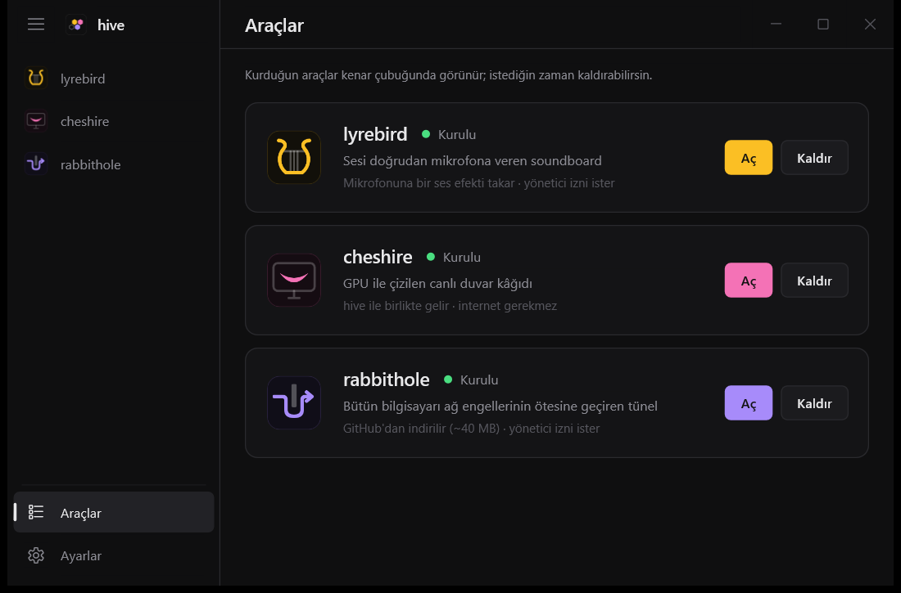

<p align="center">
  
</p>

<p align="center">
  <a href="https://github.com/matrixdurden/hive/releases/latest"></a>
  
  
  <a href="LICENSE"></a>
</p>

<br>

## Kurulum

PowerShell'e yapıştır:

```powershell
irm https://github.com/matrixdurden/hive/raw/main/install.ps1 | iex
```

Yönetici izni gerekmez. Aynı komut hive'ı günceller.

## Araçlar

hive bir başlatıcı: araçları **Araçlar** sayfasından eklenti gibi kurarsın, kurduğun her araç kenar çubuğunda ve Başlat menüsünde kendi adıyla görünür. "lyrebird" diye aratınca hive o araçta açılır.

| | | |
|:---:|---|---|
|  | **lyrebird** | Sesi doğrudan mikrofona veren soundboard. Sanal mikrofon kurmaz; Discord, oyunlar, OBS, mikrofonu dinleyen her uygulama duyar. |
|  | **cheshire** | Masaüstü ikonlarının arkasında GPU ile çizilen canlı duvar kâğıtları. Tam ekranda ve pilde kendiliğinden durur. |
|  | **rabbithole** | Bütün bilgisayarı ağ engellerinin ötesine geçiren tünel: kendi sunucun üzerinden ya da sunucusuz DPI modunda. [Ayrı depo](https://github.com/matrixdurden/rabbithole). |

<table>
  <tr>
    <td width="50%"></td>
    <td width="50%"></td>
  </tr>
  <tr>
    <td align="center"><sub>Araçlar: kur, aç, kaldır</sub></td>
    <td align="center"><sub>cheshire: duvar kâğıtları ve ayarları</sub></td>
  </tr>
</table>

## İz bırakmaz

Bir aracı kaldırınca kurulurken yaptığı her şey geri alınır: dosyalar, kayıt defteri, mikrofon ayarları, hizmetler, PATH, kısayollar. Kaldırmanın sonunda hive bunları tek tek denetler; bir şey kalmışsa kaldırma başarılı sayılmaz ve neyin kaldığını söyler.

hive'ı kaldırmak (Ayarlar'dan ya da Windows'un **Uygulamalar** listesinden) önce kurulu bütün araçları aynı şekilde kaldırır, sonra kendini.

```powershell
hive --kalinti    # kurulu olmayan araçlardan kalan iz var mı
```

## Derleme

WSL'den Windows için çapraz derlenir (`x86_64-pc-windows-gnu`, mingw gerekir):

```sh
make build      # target/x86_64-pc-windows-gnu/release/hive.exe
make install    # %LOCALAPPDATA%\Programs\hive altına kur ve başlat
make release    # app/Cargo.toml'daki sürümle GitHub'da yayın
```

| Klasör | |
|---|---|
| [`app/`](app) | hive.exe: pencere, araç sayfaları, kurulum ve kaldırma |
| [`lyrebird/`](lyrebird) | lyrebird motoru ve mikrofon efekti (`apo/`) |
| [`cheshire/`](cheshire) | cheshire motoru ve [`.cheshire` formatı](cheshire/README.md#cheshire-formatı) |

## Lisans

MIT
