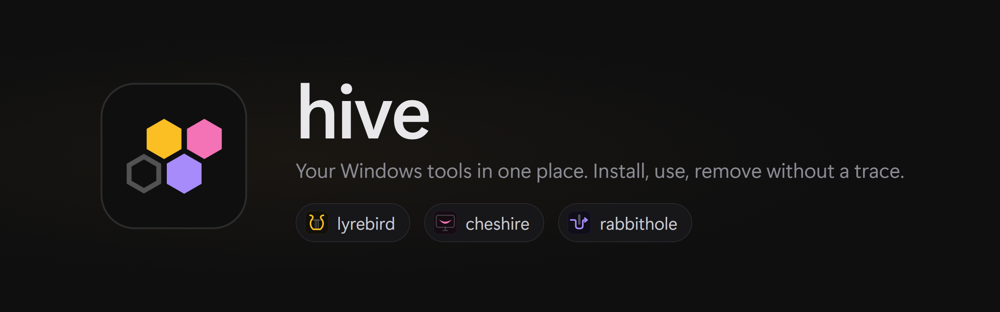
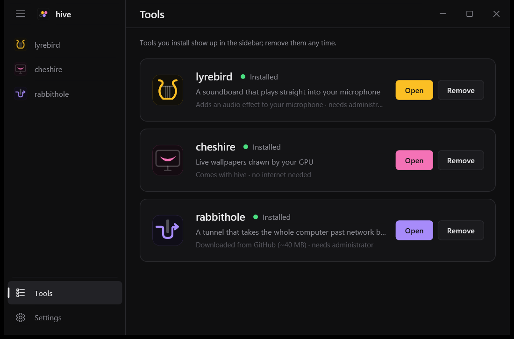

<p align="center">
  
</p>

<p align="center">
  <a href="https://github.com/matrixdurden/hive/releases/latest"></a>
  
  
  <a href="LICENSE"></a>
</p>

<p align="center"><b>English</b> · <a href="README.tr.md">Türkçe</a></p>

<br>

## Install

Paste into PowerShell:

```powershell
irm https://github.com/matrixdurden/hive/raw/main/install.ps1 | iex
```

No administrator needed. The same command updates hive.

## Tools

hive is a launcher: install tools from its **Tools** page like plugins. Every tool you install shows up in the sidebar and in the Start menu under its own name; search for "lyrebird" and hive opens on it.

| | | |
|:---:|---|---|
|  | **lyrebird** | A soundboard that plays straight into your microphone. No virtual microphone: Discord, games, OBS, anything that listens to the mic hears it. |
|  | **cheshire** | Live wallpapers drawn by your GPU behind the desktop icons. Pauses on its own in fullscreen and on battery. |
|  | **rabbithole** | Tunnels your whole computer past network blocks: through your own server, or serverless in DPI mode. [Separate repository](https://github.com/matrixdurden/rabbithole). |
|  | **dormouse** | Three gears for a laptop: plugged in, out for an hour or two, survival. Switches on its own when the charger comes and goes, keeps the discrete GPU asleep on battery and learns how long each gear really lasts. |

<table>
  <tr>
    <td width="50%"></td>
    <td width="50%"></td>
  </tr>
  <tr>
    <td align="center"><sub>Tools: install, open, remove</sub></td>
    <td align="center"><sub>cheshire: wallpapers and their settings</sub></td>
  </tr>
</table>

hive speaks English and Turkish; it follows the Windows display language and can be switched in Settings.

## No traces

Removing a tool undoes everything it did when it was installed: files, registry, microphone settings, services, PATH, shortcuts. At the end hive checks for each of them; if anything is left, the removal does not count as done and hive tells you what remains.

Removing hive (from its Settings or from Windows' **Apps** list) first removes every installed tool the same way, then itself.

```powershell
hive --leftovers    # is anything left from tools that are not installed?
```

## Build

Cross-compiled for Windows from WSL (`x86_64-pc-windows-gnu`, needs mingw):

```sh
make build      # target/x86_64-pc-windows-gnu/release/hive.exe
make install    # install under %LOCALAPPDATA%\Programs\hive and start it
make release    # GitHub release with the version in app/Cargo.toml
```

| Folder | |
|---|---|
| [`app/`](app) | hive.exe: window, tool pages, install and removal |
| [`lyrebird/`](lyrebird) | lyrebird engine and its microphone effect (`apo/`) |
| [`cheshire/`](cheshire) | cheshire engine and the [`.cheshire` format](cheshire/README.md#the-cheshire-format) |

## License

MIT
