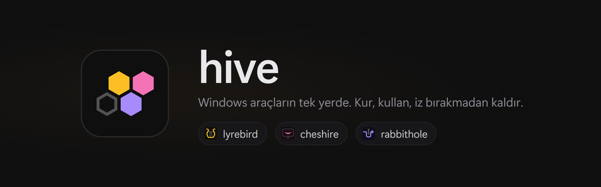
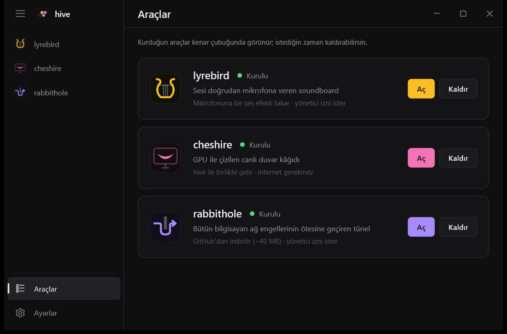
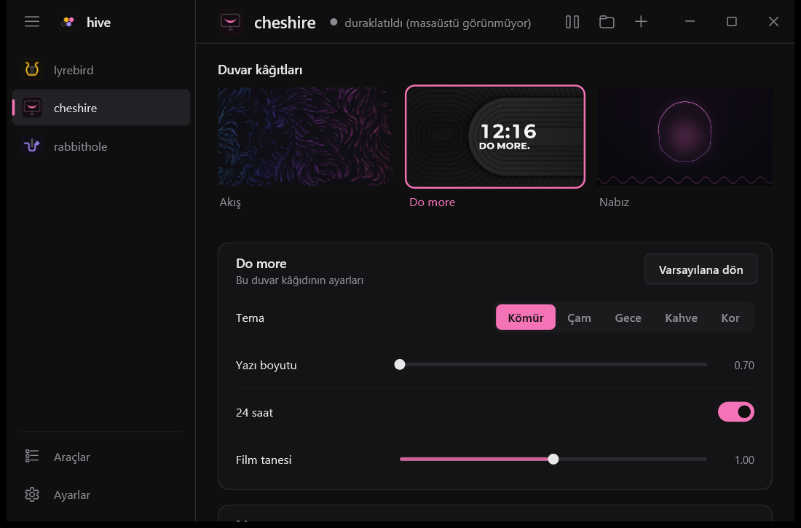

<p align="center">
  
</p>

<p align="center">
  <a href="https://github.com/matrixdurden/hive/releases/latest"></a>
  
  
  <a href="LICENSE"></a>
</p>

<p align="center"><a href="README.md">English</a> · <b>Türkçe</b></p>

<br>

## Kurulum

PowerShell'e yapıştır:

```powershell
irm https://github.com/matrixdurden/hive/raw/main/install.ps1 | iex
```

Yönetici izni gerekmez. Aynı komut hive'ı günceller.

## Araçlar

hive bir başlatıcı: araçları **Araçlar** sayfasından eklenti gibi kurarsın, kurduğun her araç kenar çubuğunda ve Başlat menüsünde kendi adıyla görünür. "Pil" diye aratınca hive o araçta açılır.

| | | |
|:---:|---|---|
|  | **Soundboard** <sub>lyrebird</sub> | Sesi doğrudan mikrofona veren soundboard. Sanal mikrofon kurmaz; Discord, oyunlar, OBS, mikrofonu dinleyen her uygulama duyar. Myinstants'ta ses ara (kulaklıkta dinle, tek tıkla ekle); bilgisayarda az önce çalan son 10 saniyeyi kısayolla (`Ctrl+Alt+L`) listeye ekle. |
|  | **Duvar kâğıdı** <sub>cheshire</sub> | Masaüstü ikonlarının arkasında GPU ile çizilen canlı duvar kâğıtları. Tam ekranda ve pilde kendiliğinden durur. |
|  | **Tünel** <sub>rabbithole</sub> | Bütün bilgisayarı ağ engellerinin ötesine geçiren tünel: kendi sunucun üzerinden ya da sunucusuz DPI modunda. [Ayrı depo](https://github.com/matrixdurden/rabbithole). |
|  | **Pil** <sub>dormouse</sub> | Dizüstü için üç vites: prizde, dışarıda bir iki saat, hayatta kalma. Şarj takılıp çıkınca kendi geçer, pildeyken ekran kartını uyutur, her vitesin gerçekte kaç saat gittiğini öğrenir. |
|  | **Ses aygıtları** <sub>tweedle</sub> | Ses çıkışları ve girişleri tek listede: tıkladığın varsayılan olur. Tek tuşla sonraki çıkışa (`Ctrl+Alt+O`), sonraki girişe (`Ctrl+Alt+I`) geçer ya da mikrofonu susturur (`Ctrl+Alt+K`). Kulaklık kopunca da müzik laptop hoparlöründen devam etmez, durur. |
|  | **Dock** <sub>hatter</sub> | Windows görev çubuğunun yerine, Windows 11 görünümünde bir dock: sabitlediğin ve açık uygulamalar yüzen tek bir çubukta, ucunda Wi-Fi, ses, pil ve saat. İmlecin altındaki simgeler büyür, dikkat isteyen uygulama zıplar, üstünde durunca pencerelerinin canlı önizlemesi açılır, sürükleyerek sıralarsın. Pencere üstüne gelince aşağı kayar (ya da istersen Mac gibi hep ekranda kalır), tam ekran oyunlarda hiç görünmez. İmleci sol üst köşeye götürünce bütün pencereler (Win+Tab), sağ alt köşeye götürünce masaüstü açılır (ikisi de kapatılabilir). Win+1…9 uygulamaları dock sırasıyla açar; "Dock'a sabitle" sağ tık menüsünde. Kaldırınca görev çubuğu ve Başlat eski haline döner. |

<table>
  <tr>
    <td width="50%"></td>
    <td width="50%"></td>
  </tr>
  <tr>
    <td align="center"><sub>Araçlar: kur, aç, kaldır</sub></td>
    <td align="center"><sub>cheshire: duvar kâğıtları ve ayarları</sub></td>
  </tr>
</table>

hive İngilizce ve Türkçe konuşur; Windows'un görüntü dilini izler, Ayarlar'dan değiştirilebilir.

## İz bırakmaz

Bir aracı kaldırınca kurulurken yaptığı her şey geri alınır: dosyalar, kayıt defteri, mikrofon ayarları, hizmetler, PATH, kısayollar. Kaldırmanın sonunda hive bunları tek tek denetler; bir şey kalmışsa kaldırma başarılı sayılmaz ve neyin kaldığını söyler.

hive'ı kaldırmak (Ayarlar'dan ya da Windows'un **Uygulamalar** listesinden) önce kurulu bütün araçları aynı şekilde kaldırır, sonra kendini.

```powershell
hive --leftovers    # kurulu olmayan araçlardan kalan iz var mı
```

## Derleme

WSL'den Windows için çapraz derlenir (`x86_64-pc-windows-gnu`, mingw gerekir):

```sh
make build      # target/x86_64-pc-windows-gnu/release/hive.exe
make install    # %LOCALAPPDATA%\Programs\hive altına kur ve başlat
make release    # app/Cargo.toml'daki sürümle GitHub'da yayın
```

| Klasör | |
|---|---|
| [`app/`](app) | hive.exe: pencere, araç sayfaları, kurulum ve kaldırma |
| [`lyrebird/`](lyrebird) | lyrebird motoru ve mikrofon efekti (`apo/`) |
| [`cheshire/`](cheshire) | cheshire motoru ve [`.cheshire` formatı](cheshire/README.md#the-cheshire-format) |

## Lisans

MIT
