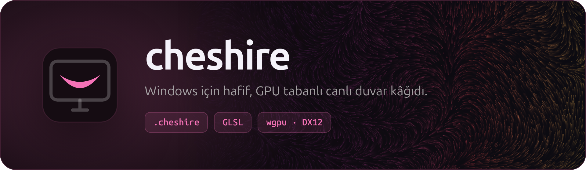
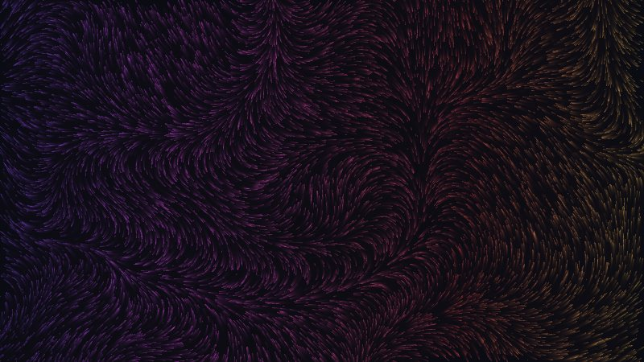
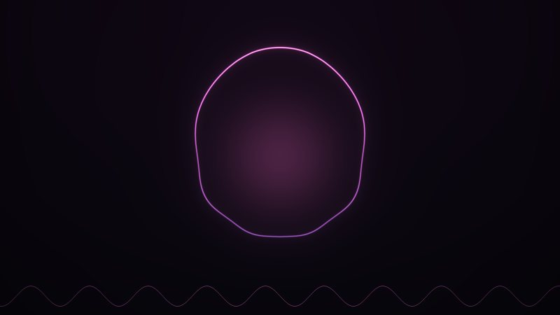

<p align="center">
  
</p>

<p align="center">
  
  
  
  
  <a href="LICENSE"></a>
</p>

<p align="center">
  <a href="#kullanım">Kullanım</a> ·
  <a href="#cheshire-formatı"><code>.cheshire</code> formatı</a> ·
  <a href="#derleme">Derleme</a>
</p>

<br>

Masaüstü ikonlarının arkasında Shadertoy lehçesinde GLSL shader'lar çizer. Tam ekran bir pencere onu kapattığında ya da (istersen) pil ile çalışırken durur.

<table>
  <tr>
    <td width="50%"></td>
    <td width="50%"></td>
  </tr>
  <tr>
    <td align="center"><b>Akış</b><br><sub>Kıvrılan bir alanda akan renkli lifler. Fare lifleri dışa iter.</sub></td>
    <td align="center"><b>Nabız</b><br><sub>Çalan müziğe tepki veren halka.</sub></td>
  </tr>
</table>

<p align="center"><sub>İkisi de <a href="ornekler"><code>ornekler/</code></a> içinde. Görseller <code>cheshire --onizleme</code> ile üretildi.</sub></p>

## Kullanım

- `cheshire.exe`'yi çalıştır. Sistem tepsisindeki simgeden duvar kâğıdını seç, parametreleri ayarla, "Windows ile başlat"ı aç.
- Bir `.cheshire` dosyasına çift tıkla ya da exe'nin üstüne sürükle: kurulur ve uygulanır.
- Ayarlar, log ve duvar kâğıtları `%APPDATA%\cheshire` altında durur.

```sh
cheshire --dogrula dosya.cheshire               # derle, 120 kare çiz, GPU süresini raporla
cheshire --onizleme dosya.cheshire cikti.png    # PNG üret
```

## `.cheshire` formatı

Metadata yorum satırlarında, gövde Shadertoy'daki gibi `mainImage`:

```glsl
// @cheshire
// ad: Akış
// fps: 60
// param hiz: 1.0 [0.2, 3]
// param renk: #ff6ec7
//--- ortak      (isteğe bağlı, her geçişin başına eklenir)
//--- buf A      (isteğe bağlı, A..D)
//--- image      (bölüm yoksa tüm gövde image sayılır)
```

| Girdi | |
| --- | --- |
| `iTime`, `iResolution`, `iMouse` | Shadertoy'daki gibi |
| `iChannel0..3` | buffer'lar (`buf A`..`buf D`) |
| `iAudio` | müziğe tepki için ses verisi |

Örnekler [`ornekler/`](ornekler) içinde.

## Derleme

WSL'den Windows için çapraz derlenir (`x86_64-pc-windows-gnu`, mingw gerekir):

```sh
make build     # target/x86_64-pc-windows-gnu/release/cheshire.exe
make install   # %LOCALAPPDATA%\Programs\cheshire altına kopyala ve başlat
```

<br>

<p align="center">
  <br>
  <sub>MIT lisansı ile.</sub>
</p>
