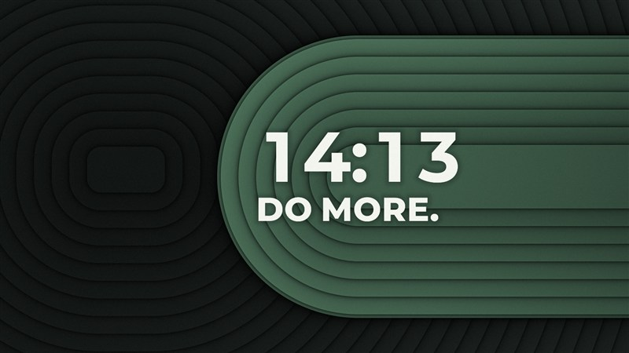

<p align="center">
  
</p>

<p align="center">
  
  
  
  <a href="../LICENSE"></a>
</p>

<br>

Draws GLSL shaders in the Shadertoy dialect behind the desktop icons. Pauses when a fullscreen window covers it or, if you want, on battery.

<table>
  <tr>
    <td width="33%"></td>
    <td width="33%"></td>
    <td width="33%"></td>
  </tr>
  <tr>
    <td align="center"><b>Flow</b><br><sub>Colored fibres flowing through a curling field. The mouse pushes them away.</sub></td>
    <td align="center"><b>Pulse</b><br><sub>A ring that reacts to the music playing.</sub></td>
    <td align="center"><b>Do more</b><br><sub>Clock and slogan over paper-cut layers, 5 color themes. Text from embedded Montserrat outlines.</sub></td>
  </tr>
</table>

<p align="center"><sub>All in <a href="ornekler"><code>ornekler/</code></a>. Images made with <code>cheshire --onizleme</code>.</sub></p>

## Use

cheshire is part of [hive](../README.md): install hive and add cheshire from its **Tools** page. Pick wallpapers and their settings on hive's cheshire page; dropping a `.cheshire` file on the window adds and applies it. The engine (`cheshire.exe --hub`) ships inside hive and runs as a separate process.

Everything lives in one folder: `%LOCALAPPDATA%\Programs\cheshire` (exe, `cheshire.ini`, `duvarlar\`, log). Removing it from hive deletes the folder, the previews and the registry entries, and the wallpaper goes back to the Windows one.

Command-line tools:

```sh
cheshire --dogrula file.cheshire               # compile, draw 120 frames, report GPU time
cheshire --onizleme file.cheshire out.png      # render a PNG
```

## The `.cheshire` format

Metadata in comment lines, the body is `mainImage` as on Shadertoy:

```glsl
// @cheshire
// ad: Flow                                   (display name)
// ad.tr: Akış                                (optional Turkish name)
// fps: 60
// param hiz "Speed" "Hız": 1.0 [0.2, 3]                              (slider; labels: English, optional Turkish)
// param tema "Theme" "Tema": night [charcoal/kömür, night/gece]      (choice; value is the index, 0..)
// param saat24 "24-hour clock" "24 saat": on                         (switch: on/off; 1 or 0)
// param renk "Color" "Renk": #ff6ec7                                 (color)
//--- ortak      (optional, prepended to every pass)
//--- buf A      (optional, A..D)
//--- image      (without sections the whole body is image)
```

Labels are optional: without them the GLSL name is shown. hive shows the Turkish label when it is in Turkish and one is given, the English one otherwise.

| Input | |
| --- | --- |
| `iTime`, `iResolution`, `iMouse` | as on Shadertoy |
| `iChannel0..3` | the buffers (`buf A`..`buf D`) |
| `iAudio` | audio data for reacting to music |

Examples in [`ornekler/`](ornekler).

## Build

From the root of the hive repository: `make build` also builds the engine and embeds it in hive.exe (`target/x86_64-pc-windows-gnu/release/cheshire.exe`).
